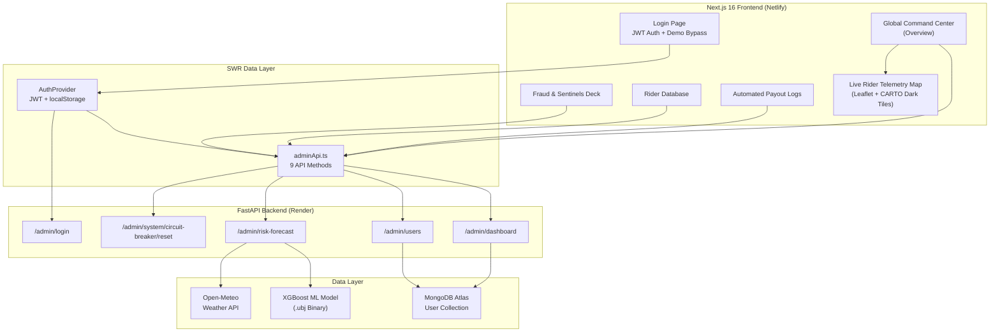
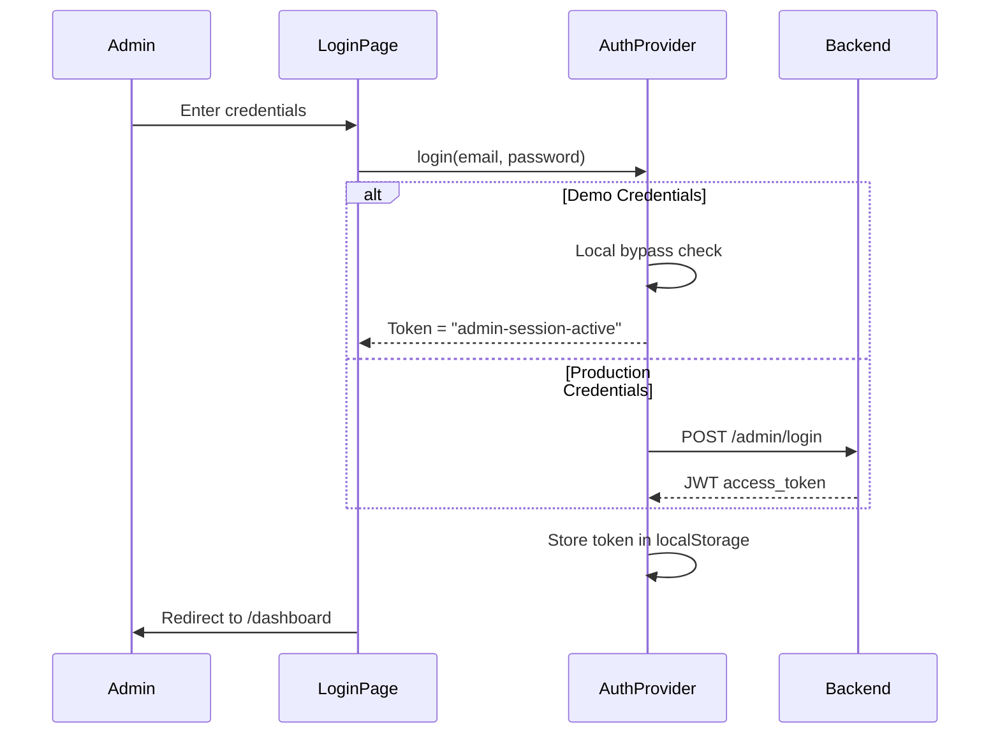

# 🛡️ GigGuard — Admin Command Center
### *Real-Time Insurtech Operations Dashboard for Parametric Gig-Worker Insurance*

---

> **Live Deployment**: [https://admingigguard.netlify.app](https://admingigguard.netlify.app)
> **Demo Credentials**: `admin@gigguard.in` / `gigguard123`
> **Tech Stack**: Next.js 16 · React 19 · TypeScript · TailwindCSS · Recharts · Leaflet · SWR

---


---

## 1. Executive Summary

The **GigGuard Admin Command Center** is a production-grade, full-stack web dashboard that provides real-time operational oversight of the entire GigGuard parametric insurance platform. It serves as the **mission-critical control panel** for insurance administrators, enabling them to:

- **Monitor** platform-wide KPIs (users, policies, premiums, payouts) in real time
- **Detect & Respond** to fraud through a 7-layer AI fraud firewall with per-rider audit profiles
- **Safeguard** against coordinated drain attacks via a Flash Crash Circuit Breaker system
- **Track** weather-driven disruption triggers that auto-initiate parametric payouts
- **Audit** every automated settlement with a transparent, searchable payout ledger
- **Visualize** rider locations on a live geospatial telemetry map

> [!IMPORTANT]
> This is **not a static mockup**. The dashboard connects to the live production FastAPI backend at `https://gigshield-4u5z.onrender.com`, fetching real MongoDB data, live risk forecasts, and circuit breaker state. A demo bypass mode with simulated data is also available for offline judging.

---

## 2. Architecture Overview



### Data Flow Summary

| Flow | Path | Data |
|------|------|------|
| **Authentication** | `LoginPage → AuthProvider → /admin/login` | JWT token stored in localStorage |
| **Dashboard Stats** | `CommandCenter → SWR → /admin/dashboard` | Users, policies, premiums, payouts |
| **Circuit Breaker** | `CommandCenter + FraudDeck → SWR → /admin/dashboard` | Freeze state, velocity, limit |
| **Weather Triggers** | `CommandCenter → SWR → /admin/risk-forecast` | Disruption alerts by severity |
| **Risk Forecast** | `CommandCenter → SWR → /admin/risk-forecast` | 7-day daily risk probabilities |
| **All Users** | `RiderDatabase + FraudDeck → SWR → /admin/users` | Full rider profiles + trust scores |
| **High-Risk Users** | `FraudDeck + Map → SWR → /admin/users (filtered)` | Users with `trust_score < 50` |
| **Payouts** | `PayoutLogs → SWR → /admin/dashboard` | Settlement trail + UTR tracking |

---

## 3. Authentication & Security



### Security Features

| Feature | Implementation |
|---------|---------------|
| **JWT Authentication** | Bearer token in Authorization header for all API calls |
| **Session Persistence** | Token hydrated from `localStorage` on mount via `useEffect` |
| **Auto-Redirect** | Unauthenticated users are redirected to `/login` by the `DashboardLayout` guard |
| **Token Expiry Handling** | 401 responses trigger automatic token clear + redirect to login |
| **Demo Bypass** | Hardcoded `admin@gigguard.in` / `gigguard123` with simulated API responses |
| **Level 5 Access** | UI displays clearance level indicator in sidebar user badge |

---

## 4. Dashboard Modules — Deep Dive

### 4.1 — Global Command Center (`/dashboard`)

> *"Real-time telemetry and automated payout monitoring."*

The primary landing page. A high-density operations overview consolidating all critical platform metrics into a single view.

#### Key Components

##### Top-Level Metric Cards (4x Grid)

| Card | Data Source | Format | Icon |
|------|-----------|--------|------|
| **Total Users** | `adminStats.totalUsers` | Locale-formatted integer | `Users` |
| **Active Policies** | `adminStats.activePolicies` | Locale-formatted integer | `ShieldCheck` |
| **Premiums Collected** | `adminStats.premiumsCollected` | `₹X.XXL` (lakhs) | `Wallet` |
| **Payouts (24h)** | `adminStats.automatedPayouts24h` | `₹Xk` (thousands) | `Zap` |

Each card features:
- Skeleton loading states with `animate-pulse` placeholders
- Dark glassmorphic card design (`bg-[#131823]`, `border-[#1E2536]`)
- Lucide React icon badge with cyan accent

##### Flash Crash Circuit Breaker Monitor

> [!CAUTION]
> This is a **critical safety system**. If automated payouts exceed **₹50,000 in any 5-minute sliding window**, a `GLOBAL_PAYOUT_FREEZE` is triggered to prevent coordinated drain attacks.

The monitor displays:
- **Real-time velocity bar** — Animated progress bar showing current payout velocity vs. the ₹50,000 threshold
- **Status badge** — `ACTIVE / MONITORING` (green) or `FROZEN` (red, pulsing)
- **Unfreeze action** — Emergency unfreeze button appears only when the circuit is tripped
- Color transitions from cyan → red as the velocity approaches the limit

##### Live Weather Disruption Feed

Connected to the `/admin/risk-forecast` endpoint, this panel transforms raw risk data into a prioritized alert feed:

- **Severity indicators**: 🔴 High / 🟡 Warning / 🟢 Safe (color-coded dots)
- **Region tagging**: Each alert tagged with geographic zone (e.g., "Delhi NCR")
- **Timestamp tracking**: ISO timestamps displayed in monospace font
- **Auto-generated alerts** from daily risk probabilities > 30%

##### 7-Day Risk Forecast / Payout Analytics Chart

Built with **Recharts** (`AreaChart`):
- Gradient-filled area chart with cyan-to-transparent fill
- Custom dark tooltip with glassmorphism styling
- Responsive container that adapts to panel dimensions
- Dual-mode: Shows risk forecast when available, falls back to payout analytics

##### Live Rider Telemetry Map (On-Demand)

> [!TIP]
> The map is **performance-gated** — it only loads when the admin explicitly clicks "Load Live Telemetry Map" to avoid unnecessary Leaflet DOM overhead.

- **React-Leaflet** with CARTO Dark tile layer for consistent dark-mode aesthetics
- Custom `divIcon` markers: cyan for nominal riders, red-pulsing for high-risk
- Click-to-reveal popups showing rider ID, trust score, and active fraud flags
- Fallback coordinates across 8 Indian cities (Delhi NCR, Mumbai, Bangalore, Chennai, Kolkata)

---

### 4.2 — Fraud & Sentinels Deck (`/dashboard/fraud`)

> *"High-stakes security monitoring and Level 7 Fraud Engine telemetry."*

The fraud operations center for investigating suspicious riders and managing the circuit breaker.

#### Key Components

##### Circuit Breaker Status Banner

A full-width, color-coded alert banner:

| State | Appearance | Action |
|-------|-----------|--------|
| **Loading** | Skeleton pulse animation | — |
| **STABLE** | Green border, pulsing green dot, "SYSTEM STABLE" message | Simulate Trip button |
| **TRIPPED** | Red background, Lock icon, critical alert with velocity details | Unfreeze / Audit button |

The **Unfreeze** action calls `POST /admin/system/circuit-breaker/reset` and optimistically updates the SWR cache.

##### Rider Risk Ledger (Data Table)

A sortable, searchable table displaying all riders with:

| Column | Data | Visual |
|--------|------|--------|
| Rider ID | `gig_rider_id` | Cyan highlight on hover |
| Email | `email` | Slate text |
| Trust Score | `trust_score` (0–100) | Red (`<50`) or Green (`≥50`) monospace |
| Active Policy | `active_policy.tier` | Pill badge with dark border |
| Risk Level | Computed from trust score | `HIGH RISK` (red badge) or `Nominal` (green badge) |
| Fraud Flags | `fraud_flags[]` | Orange micro-badges, truncated |
| Action | Click handler | "Audit Profile →" button |

##### Rider Audit Modal

Clicking any row opens a detailed audit modal with:

1. **Header**: Rider ID, email, and large Trust Score badge (color-coded)
2. **Policy Telemetry**: Active tier, baseline GPS anchor, and policy status
3. **Level 7 Fraud Strikes**: Each fraud flag rendered as an orange alert card with:
   - Flag description (e.g., "OSRM Kinematics Mismatch")
   - Source attribution: "Detected via Sensor Fusion API • Requires manual override"
4. **Action Footer**: "Dismiss Flags / False Positive" and "Freeze Account & Revoke Policy" buttons

---

### 4.3 — Rider Database (`/dashboard/riders`)

> *"Complete registry of active policies and rider telemetry."*

A full-text-searchable MongoDB collection browser displaying every registered rider.

#### Key Components

##### Database Table

| Column | Details |
|--------|---------|
| **Gig Rider ID** | Monospace, cyan-on-hover |
| **Name / Email** | Two-line cell with name + email |
| **Trust Score** | Three-tier coloring: Green (≥80), Amber (50–79), Red (<50) |
| **Policy Status** | Active/Inactive dot + tier pill badge |
| **Fraud Flags** | Up to 2 visible flags + "+N" overflow counter, or "Clean" badge |

##### Rider Audit Profile Modal

A comprehensive rider deep-dive with four sections:

1. **Meta Stats Grid** (4 cards): Trust Score, Policy Tier, Baseline Lat/Lon
2. **System Telemetry & Fraud Strikes**: Each flag with algorithm confidence % and sensor source
3. **Raw Document Sync**: Live JSON view of the complete MongoDB document (`JSON.stringify` with pretty-print)
4. **Action Footer**: "Close", "INITIATE MANUAL REVIEW" (for flagged riders) or "UPDATE POLICY" (for clean riders)

---

### 4.4 — Automated Payout Logs (`/dashboard/payouts`)

> *"Settlement trail and UTR tracking for transparent auditing."*

A dual-panel view combining a searchable transaction ledger with real-time analytics.

#### Key Components

##### Settlement Trail Table (2/3 width)

| Column | Details |
|--------|---------|
| **Transaction ID** | Monospace font, slate text |
| **Amount** | Bold white, `₹` formatted with `.toLocaleString()` |
| **Recipient** | Rider's `gig_rider_id` |
| **Trigger** | Weather event that activated the payout |
| **Status** | Color-coded pill: ✅ Settled (green), ⏳ Pending (amber), ❌ Failed (red) |

Features:
- Full-text search across Transaction ID, User ID, and Trigger Name
- Sticky header with backdrop blur for long scrolls
- Auto-polling every 30 seconds via SWR `refreshInterval`

##### Payout Distribution Chart (1/3 width, top)

- **Recharts AreaChart** with custom `ResizeObserver`-based responsive sizing
- Cyan gradient fill with dark glassmorphic tooltip
- Data derived from the 10 most recent payout records

##### Live Transaction Feed (1/3 width, bottom)

A terminal-style real-time feed showing:
```
[LIVE] 14:23:05 - SETTLED ₹1,200 to GG-1001
[LIVE] 14:22:58 - PENDING ₹800 to GG-1002
```

---

## 5. The 7-Layer Fraud Firewall

The admin dashboard surfaces the results of GigGuard's 7-layer fraud detection engine, which runs server-side for every payout claim:

| Layer | Detection Method | Dashboard Surface |
|-------|-----------------|-------------------|
| **1. Haversine Geofence** | 40km radius check from baseline GPS | Fraud flag: "Geofence Violation" |
| **2. OSRM Kinematic Speed** | Route-based speed plausibility via OSRM | Fraud flag: "OSRM Kinematics Mismatch" |
| **3. IP Datacenter Detection** | ip-api.com VPN/proxy fingerprinting | Fraud flag: "Datacenter IP Detected" |
| **4. 3D Altitude Trap** | Open-Meteo topographical altitude verification | Fraud flag: "Altitude Anomaly" |
| **5. Temporal Ping Consistency** | Coefficient of Variation on location ping intervals | Fraud flag: "Temporal Anomaly" |
| **6. Behavioral Claim Ratio** | Historical claim frequency analysis | Fraud flag: "High Claim Ratio" |
| **7. API Fail-Safe "Fog of War"** | Penalty applied when API verification fails | Fraud flag: "Verification Unavailable" |

Each layer contributes to a composite `FraudVerdict` score. No single anomaly causes a false ban — the system requires **convergence across multiple layers** before flagging a rider.

---

## 6. Technology Stack

### Frontend

| Technology | Version | Purpose |
|-----------|---------|---------|
| **Next.js** | 16.2.3 | React framework with App Router, SSR, and route-level code splitting |
| **React** | 19.2.4 | UI library with hooks-only architecture |
| **TypeScript** | 5.x | Full type safety across all components and API contracts |
| **TailwindCSS** | 3.4.19 | Utility-first styling with custom dark glassmorphism design tokens |
| **SWR** | 2.4.1 | Stale-while-revalidate data fetching with manual revalidation |
| **Recharts** | 3.8.1 | Composable charting (AreaChart with custom gradients) |
| **React-Leaflet** | 5.0.0 | Geospatial map visualization with CARTO Dark tiles |
| **Leaflet** | 1.9.4 | Core mapping engine |
| **Lucide React** | 1.8.0 | 20+ icons used across all components |

### Backend (Connected)

| Technology | Purpose |
|-----------|---------|
| **FastAPI** | Python async API framework |
| **MongoDB Atlas** | User data, policies, payout history |
| **XGBoost** | ML-driven risk pricing (R² = 0.8795, 39 features) |
| **Open-Meteo** | Real-time weather data for disruption triggers |
| **Razorpay** | Payment integration (sandbox mode) |

### Deployment

| Service | Role |
|---------|------|
| **Netlify** | Frontend hosting with automatic CI/CD from Git |
| **Render** | Backend hosting (512MB free tier, memory-optimized) |

---

## 7. Design System — Dark Glassmorphism

The dashboard follows a meticulously crafted **Dark Glassmorphism** design language:

### Color Palette

| Token | Hex | Usage |
|-------|-----|-------|
| `bg` | `#0B0F19` | Global background |
| `bg-card` | `#131823` | Card/panel backgrounds |
| `bg-deep` | `#0B0F19` | Nested container backgrounds |
| `border` | `#1E2536` | All card borders |
| `text-primary` | `#FFFFFF` | Headings, values |
| `text-secondary` | `#CBD5E1` | Body text (slate-300) |
| `text-muted` | `#94A3B8` | Labels, descriptions (slate-400) |
| `accent-cyan` | `#22D3EE` | Primary accent, charts, highlights |
| `accent-teal` | `#14B8A6` | Icon accents, sidebar |
| `status-safe` | `#22C55E` | Emerald — stable systems |
| `status-warning` | `#F59E0B` | Amber — warnings |
| `status-danger` | `#EF4444` | Red — critical alerts |

### Typography

| Role | Font | Weight |
|------|------|--------|
| Headings | **Outfit** | 600–800 |
| Body | **Inter** | 400–600 |
| Data/Mono | **System Monospace** | 400–700 |

### Component Patterns

- **Cards**: `rounded-2xl`, `bg-[#131823]`, `border border-[#1E2536]`
- **Buttons**: Uppercase tracking-wider, rounded-xl, border-only or gradient fills
- **Status Badges**: Inline-flex with icon, uppercase 10px, colored bg/text/border
- **Modals**: `backdrop-blur-sm`, `zoom-in-95` entry animation, layered z-index
- **Loading States**: `animate-pulse` skeleton placeholders matching component dimensions
- **Charts**: Dark tooltips with `backdrop-filter: blur(10px)` and `rgba` borders

---

## 8. Performance Optimizations

| Optimization | Technique | Impact |
|-------------|-----------|--------|
| **Lazy Map Loading** | `dynamic(() => import(...), { ssr: false })` | Leaflet only loads on explicit user action |
| **On-Demand Map Render** | `useState(false)` toggle for map visibility | Zero Leaflet DOM overhead by default |
| **SWR Manual Revalidation** | `revalidateOnFocus: false`, `revalidateIfStale: false` | No background polling; data refreshed via manual "Refresh All" button |
| **ResizeObserver Charts** | Custom `useContainerSize()` hook | Charts resize without layout thrashing |
| **SSR Disabled for Maps** | `ssr: false` on all Leaflet imports | Prevents `window is not defined` SSR crashes |
| **Animation Suppression** | `isAnimationActive={false}` on chart Areas | Eliminates CPU-intensive SVG animations during Fast Refresh |
| **Optimistic SWR Updates** | `mutate()` with inline data for circuit breaker | Instant UI feedback without waiting for network round-trip |

---

## 9. File Structure

```
admin1/
├── app/
│   ├── layout.tsx              # Root layout — AuthProvider wrapper, dark theme
│   ├── page.tsx                # Root redirect → /login
│   ├── globals.css             # Global styles + Google Fonts import
│   ├── login/
│   │   └── page.tsx            # Secure login with gradient CTA button
│   └── dashboard/
│       ├── layout.tsx          # Auth-guarded layout + Sidebar
│       ├── page.tsx            # Global Command Center (393 lines)
│       ├── fraud/
│       │   └── page.tsx        # Fraud & Sentinels Deck (320 lines)
│       ├── riders/
│       │   └── page.tsx        # Rider Database (325 lines)
│       └── payouts/
│           └── page.tsx        # Automated Payout Logs (216 lines)
├── components/
│   ├── layout/
│   │   └── Sidebar.tsx         # 4-item nav + user badge + logout
│   ├── LiveRiderMap.tsx        # Map wrapper with dark-mode Leaflet overrides
│   └── MapCore.tsx             # React-Leaflet core with custom divIcon markers
├── lib/
│   ├── auth.tsx                # AuthContext + AuthProvider (JWT + demo bypass)
│   ├── mockData.ts             # Admin-fed fallback GPS coordinates (8 cities)
│   ├── api/
│   │   └── adminApi.ts         # 9-method API client (338 lines)
│   └── types/
│       └── admin.ts            # TypeScript interfaces (72 lines)
├── tailwind.config.ts          # Custom dark glassmorphism design tokens
├── package.json                # Dependencies manifest
└── .env.local                  # NEXT_PUBLIC_API_URL configuration
```

---

## 10. API Integration Layer

The `adminApi.ts` client provides **9 typed methods** that abstract all backend communication:

| # | Method | Endpoint | Returns |
|---|--------|----------|---------|
| 1 | `fetchAdminStats()` | `GET /admin/dashboard` | `AdminStats` — users, policies, premiums, payouts |
| 2 | `fetchAllUsers()` | `GET /admin/users` | `User[]` — complete rider registry |
| 3 | `fetchHighRiskUsers()` | `GET /admin/users` (filtered) | `User[]` — riders with `trust_score < 50` |
| 4 | `fetchRiskForecast()` | `GET /admin/risk-forecast` | `RiskForecast` — 7-day daily risk array |
| 5 | `fetchCircuitBreaker()` | `GET /admin/dashboard` (extracted) | `CircuitBreakerStatus` — freeze state + velocity |
| 6 | `resetCircuitBreaker()` | `POST /admin/system/circuit-breaker/reset` | `{ status: string }` |
| 7 | `fetchWeatherTriggers()` | `GET /admin/risk-forecast` (transformed) | `WeatherTrigger[]` — severity-tagged alerts |
| 8 | `fetchPayouts()` | `GET /admin/dashboard` (extracted) | `PayoutRecord[]` — settlement trail |
| 9 | `fetchHealth()` | `GET /health` | Health check (no auth) |

> [!NOTE]
> All methods include **demo bypass logic**: when the stored token is `"admin-session-active"` (from demo login), the client returns realistic simulated data with a 600ms artificial delay — ensuring the dashboard is fully functional even when the backend is cold-starting on Render's free tier.

---

## 11. Judge Quick-Start Guide

### Option A: Live Demo (Recommended)

1. Open [https://admingigguard.netlify.app](https://admingigguard.netlify.app)
2. Login with `admin@gigguard.in` / `gigguard123`
3. Explore all 4 tabs: **Overview → Fraud Deck → Rider Database → Payout Logs**
4. Click "Refresh All" on the Command Center to trigger a live data sync
5. Click any rider row in the Fraud Deck or Rider Database to open the audit modal
6. Click "Simulate Tripped State" on the Fraud Deck to see the circuit breaker in action

### Option B: Run Locally

```bash
cd admin1
npm install
npm run dev
# Dashboard available at http://localhost:3000
```

> [!TIP]
> The dashboard is pre-configured to connect to the live production backend. No `.env` changes are needed for a full demo experience.

---

## 12. Key Technical Differentiators

| Feature | Why It Matters |
|---------|---------------|
| **Production-Grade Architecture** | Not a prototype — full Next.js 16 + React 19 with TypeScript, proper error boundaries, and loading states |
| **Real Backend Integration** | Connected to a live FastAPI + MongoDB + XGBoost stack, not just mock data |
| **7-Layer Fraud Engine Visualization** | Each fraud detection layer is surfaced with per-rider audit trails |
| **Flash Crash Circuit Breaker** | A genuine financial safety system with live velocity monitoring and admin override |
| **Weather-Driven Parametric Triggers** | Real Open-Meteo data transformed into actionable disruption alerts |
| **Geospatial Telemetry Map** | Live Leaflet map with custom dark tiles and risk-colored markers across Indian cities |
| **Performance-First Design** | On-demand map loading, SSR-safe dynamic imports, manual SWR revalidation |
| **Graceful Degradation** | Demo bypass with simulated data ensures the dashboard works even if the backend is offline |
| **Enterprise-Grade UI/UX** | Dark glassmorphism design system with custom typography, micro-animations, and skeleton loading |

---

*Built with ♠ by the GigGuard team — Parametric insurance, reimagined for India's gig economy.*
